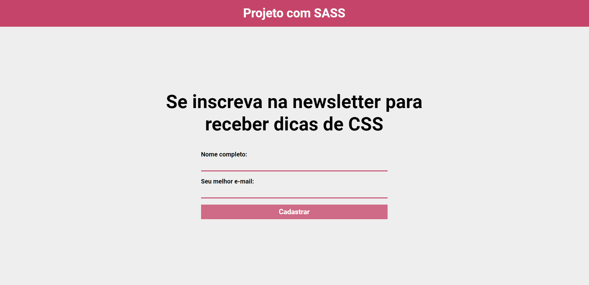

# Mini Project with SASS

   

 

  
  
  # How did the idea come about?
  
This page was developed using HTML and SASS.

This project was made for me to put into practice my learnings with SASS

- Variables
- Mixins
- Functions
- Operations

## See Page in action

Try with our [live demo](https://mini-projeto-com-sass.vercel.app/).

